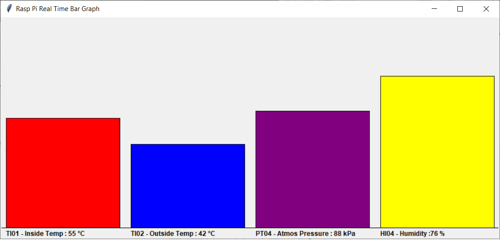
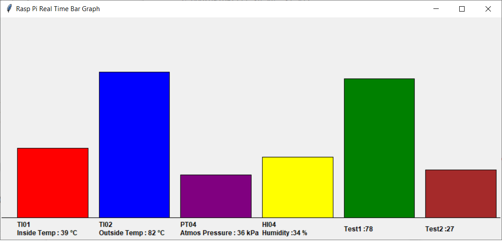

# Python-Realtime-Bars
A Python realtime bars template for IoT or Raspberry Pi projects



This is a Python tkinter dynamic bars example. My goal was to make a template that I could use for Raspberry Pi and Python IoT projects where I needed to have some dynamic values in a group of bar charts.


The code has support for a configurable number of bars. Each bar can have:
- a bar color
- bar text (for example 'tagname-description')
- units for the value
- high range (Note: the code only uses a low range value of 0)
- starting value

A code snippet from tkbar.py that defines the bars is below:  
```python
# Define the canvas size 
c_width = 900
c_height = 400
c_margin = 20 # top and bottom margin
b_space = 20 # space between bars

root = Tk()
root.geometry(str(c_width) + "x" + str(c_height) + "+100+100")
root.title("Rasp Pi Real Time Bar Graph")

# Adjust the arrays definitions to match the number of charts
numchart = 4
bcols = ["red","blue","purple","yellow"]
btext = ["TI01 - Inside Temp : ","TI02 - Outside Temp : ","PT04 - Atmos Pressure : ","HI04 - Humidity :"]
units = [" °C", " °C", " kPa"," %"]
hrange = [100,100,150,100]
bvalue = [0,0,0,0] # This is an array of the real time values (that come from a Rasp Pi, IoT, etc.)
```

There are three functions in the code:

- **_timerupdate()_** - this is the update function, that by default is set to a 5 second update
- **_get_values()_** - add your custom Rasperry Pi or IoT calls for new data here. By default random values are inserted
- **_resize_rect()_** - resize the bars based on the new realtime values, and write the real time values to the bar heading.

##Some basic usability considerations

If the font of the bar headings is increase, the margin space (_c_margin_) will probably need to be reviewed.

The default code is designed for a 1 line bar description. If the space is tight or there a lot of bars then multiple lines can be defined using  **_\n_** in the text.

For example : btext = ["TI01\nInside Temp : ","TI02\nOutside Temp : ... "]

Below is an screen shot of 6 bars with some text spanning 2 lines.




